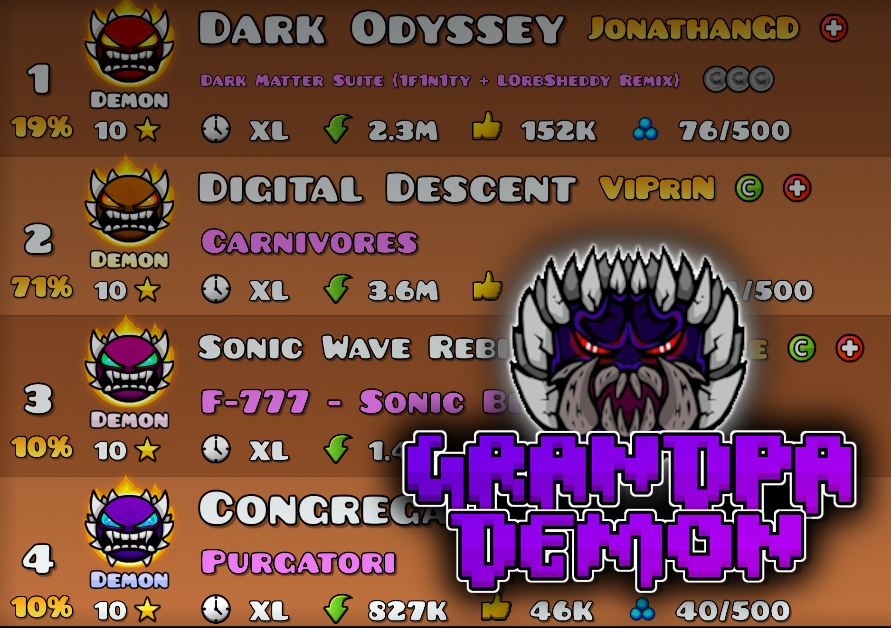
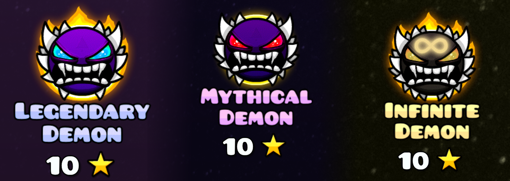

# Grandpa Demon
A mod created by ItzKiba.

## Overview
The humble Extreme Demon is the highest difficulty in all of Geometry Dash. **However, there is no possible way that Acheron and ACU should be considered the same difficulty.** Think that there should be more demon difficulties above Extreme? Look no further than the **Grandpa Demon mod!**

## Features
* *Up to 6 new demon difficulties* above Extreme Demon!
* *All Rated Extremes Demon List* integration for choosing the demon difficulties.
* *2.2 List support!*
* ***Grandpa Demon!***

**Additionally, the highest demon difficulties each have their own **animated backgrounds** for the level page!*

## New Demon Difficulties
The difficulties of extreme demons are chosen based on their positions on the [AREDL](https://aredl.pages.dev/#/).

* Top 500 Demons - *Supreme Demon*
* Top 250 Demons - *Ultimate Demon*
* Top 150 Demons - *Legendary Demon*
* Top 75 Demons - *Mythical Demon*
* Top 25 Demons - *Infinite Demon*
* Top 1 Demon - *Grandpa Demon*

***Note:** Grandpa Demon is optional and can be disabled in the mod's settings.*

## Credits
* **tcoffa** for creating the original Grandpa Demon sprite
* **Geode's Discord** for answering my stupid questions
* **AeonAir** for making me do this out of spite in the first place